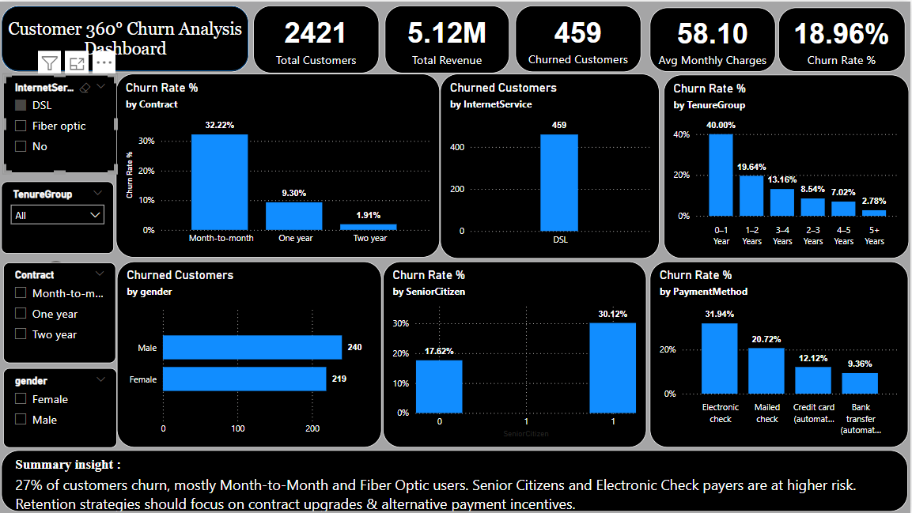

Got it 👍 Adding **links to your repo files & images** inside the README so recruiters can directly click & view/download.

Here’s the improved version 👇

---

# 📊 Customer 360° Churn Analysis Dashboard

This project analyzes **telecom customer churn** using Power BI, providing a **360° view of customer behavior, retention risks, and business insights**.

## 📂 Project Contents

* [Customer 360° Churn Analysis Dashboard.pbit](./Customer%20360%C2%B0%20Churn%20Analysis%20Dashboard.pbit) → Power BI dashboard file.
* [Customer 360° Churn Analysis Dataset.xlsx](./Customer%20360%C2%B0%20Churn%20Analysis%20Dataset.xlsx) → Dataset used for analysis.
* Dashboard Images:

  * [Dashboard Main View](./Dashboard%20Main%20View.png)
  * [Dashboard-1](./Dashboard-1.png.png)
  * [Dashboard](./Dashboard.png)

## 🚀 Key Features

✔️ **Churn Rate Tracking** – Overall churn % with clear KPIs
✔️ **Customer Segmentation** – By tenure, contract type, payment method, and internet service
✔️ **Risk Identification** – Highlighting high-risk groups (Month-to-Month, Fiber Optic, Senior Citizens)
✔️ **Retention Insights** – Suggestions to improve retention (contract upgrades, alternative payments)

## 📈 Key Insights

* \~27% of customers churn.
* **Month-to-Month** and **Fiber Optic** customers churn the most.
* **Senior Citizens** and **Electronic Check** payers are at higher risk.
* Retention should focus on **contract upgrades** & **alternative payment options**.

## 🖼️ Dashboard Preview

### Main View

### Detailed View

## ⚙️ Tools & Technologies

* **Power BI** – Data modeling & visualization
* **Excel** – Dataset storage & cleaning

## 📌 How to Use

1. Download the dataset (`.xlsx`) and dashboard (`.pbit`).
2. Open the `.pbit` file in **Power BI Desktop**.
3. Load the dataset and refresh visuals.

---

